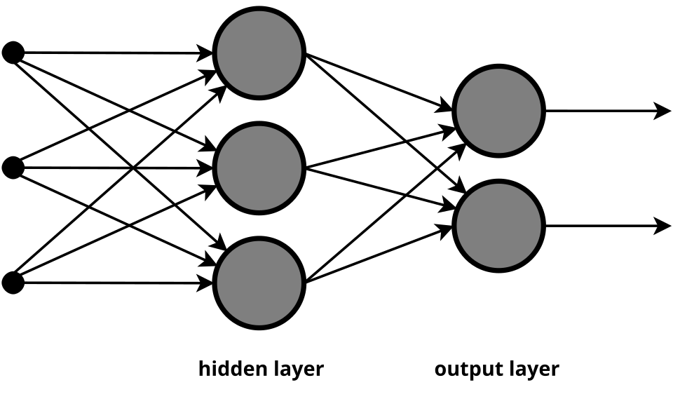

# Session notes — 18 Apr 2026 — SOTA (transformer-based) embeddings → start of Transformers module

## Transcript timing extraction (session + Q&A split)

- Session start time: `00:04:21.060`
- Session conclusion time (teaching concluded cue): `04:40:08.369`
- Q&A segment: `04:40:04.910` to `04:51:56.300` (`00:11:51.390`)
- Full recording span (`.vtt` first cue to last cue): `04:47:35.240`

**Source:** `_Recording.transcript.vtt`  
**Instructor:** Sunny Savita  

---

## Materials in this folder (`18Apr26/`)

| File | Role |
|------|------|
| [`SOTA-llm-embedding.ipynb`](SOTA-llm-embedding.ipynb) | Main lab: **SOTA text embeddings** (Sentence Transformers / `all-MiniLM-L6-v2`, 384-d), **LangChain** wrappers for **Gemini** & **OpenAI** embeddings, **CLIP** image embeddings, **semantic vs keyword** retrieval — see notebook title cell. |
| [`Class-08-18-Apr-SOTA-Transformer-Embedding-Methods/SOTA-llm-embedding.ipynb`](Class-08-18-Apr-SOTA-Transformer-Embedding-Methods/SOTA-llm-embedding.ipynb) | Same notebook under the **Class 8** subfolder (use one copy; keep paths consistent when you run cells). |
| [`Class-08-18-Apr-Notion-Notes.pdf`](Class-08-18-Apr-Notion-Notes.pdf) | Notion export — commands, links, snippets from class. |
| [`Class-08-18-Apr-Hand-written-notes.pdf`](Class-08-18-Apr-Hand-written-notes.pdf) | Handwritten board notes — **4 pages** (see **Handwritten board notes** below for a page-by-page outline). |
| [`images.jpg`](images.jpg) | Sample **image** asset for CLIP / vision-embedding demos in the notebook (path may be referenced from the working directory). |
| [`image/attention-is-all-you-need-encoder-decoder-figure1.png`](image/attention-is-all-you-need-encoder-decoder-figure1.png) | **Published** encoder–decoder diagram (same content as *Attention Is All You Need* Figure 1; see **Original diagrams** below). |
| [`image/feedforward-nn-multi-layer.png`](image/feedforward-nn-multi-layer.png) | **Standard** feedforward NN schematic (PNG — best for Markdown preview). Scalable copy: [`image/feedforward-nn-multi-layer.svg`](image/feedforward-nn-multi-layer.svg). |
| [`Notes.md`](Notes.md) | This summary. |
| `_Recording.transcript.vtt` | Full transcript (often **gitignored**; keep locally next to notes). |

**Environment:** The notebook expects a **`.env`** file with `GOOGLE_API_KEY`, `HF_TOKEN`, and/or `OPENAI_API_KEY` as needed (see first code cell — **never commit** secrets). The first cell loads **`.env`** from the current working directory or the **parent** folder. The **CLIP** image cell resolves **`images.jpg`** from the session folder (or `../images.jpg` if your kernel cwd is the nested `Class-08-…` directory). Install deps from your project `requirements.txt` / uv env as for other class folders.

**One-line topic:** **State-of-the-art (transformer-based) text & image embeddings** and how they connect to **RAG** — bridge from module 1 into the **Transformers** module.

---

## Where this sits in the syllabus

- **Module 1 (encoding & embedding)** is treated as **complete** from a syllabus perspective; one conceptual bridge remained: **SOTA embeddings** (transformer-based) before fully opening **Transformers**.
- **Module 2** starts here: **Transformer** architecture — described as **2–3 sessions** with optional **from-scratch** code to run; then **LLMs/SLMs and APIs**, then **fine-tuning**, **RAG**, **agentic RAG**, etc.
- **Assignment** from the embedding block: solution was being pushed to **Resources** + **GitHub** (per class admin — verify in your dashboard/repo).

---

## Why this session matters (even if you only “ship” RAG apps)

- For **pure app wiring**, you may rarely implement attention by hand — but **interviews** and **LLM intuition** lean on **self-attention**, **multi-head attention**, and how **decoder-only** models (e.g. **GPT**) relate to **pre-training** and **next-token prediction**.
- **SOTA embeddings** (sentence-transformers, OpenAI, Gemini, etc.) are positioned as **directly reused in RAG** and later **agentic** chapters — same vectors you store and retrieve.

---

## SOTA embedding — live coding themes (aligned with `SOTA-llm-embedding.ipynb`)

- **`sentence-transformers`** (Hugging Face Hub): **`all-MiniLM-L6-v2`** → **384-dimensional** dense vectors; **`encode()`** for word, sentence, or paragraph (fixed output dim after pooling).
- **LangChain** abstractions for **Google Gemini** and **OpenAI** embedding APIs — same notebook compares providers and vector sizes where applicable.
- **Contrast** with earlier **Word2Vec**: classical models expose **hidden-layer** style vectors; **SOTA** stacks use **transformers**; embeddings remain the **vectors you index** for retrieval.
- **Multimodal:** **CLIP** (and related) for **image → embedding**; ties to multimodal RAG later.
- **Retrieval angle:** notebook frames **semantic** vs **keyword** search using these embeddings (foundation for **vector DB** chapters).
- **Secrets:** **`.env`** with `GOOGLE_API_KEY`, `HF_TOKEN`, `OPENAI_API_KEY` — loaded in the notebook via **`python-dotenv`**; **do not commit** keys.

### Tutor links (from Notion notes PDF)

Same references appear in [`Class-08-18-Apr-Notion-Notes.pdf`](Class-08-18-Apr-Notion-Notes.pdf); grouped here by how they map to **`SOTA-llm-embedding.ipynb`**.

**Sentence Transformers (local / Hub models — aligns with the `sentence-transformers` + `all-MiniLM-L6-v2` part of the lab)**

- Sentence Transformers org on Hugging Face: [https://huggingface.co/sentence-transformers](https://huggingface.co/sentence-transformers)
- Browse models filtered by the Sentence Transformers library (sorted by downloads): [https://huggingface.co/models?library=sentencetransformers&sort=downloads](https://huggingface.co/models?library=sentencetransformers&sort=downloads)

**API keys & tokens (for LangChain Gemini / OpenAI embedding cells and any Hub-gated models)**

- OpenAI — quickstart / API key flow: [https://developers.openai.com/api/docs/quickstart](https://developers.openai.com/api/docs/quickstart)
- Google AI Studio — Gemini API keys (URL may include a `project=` query from class; use **your** project in AI Studio if the link does not match your account): [https://aistudio.google.com/api-keys?project=peppy-freedom-447409-d3](https://aistudio.google.com/api-keys?project=peppy-freedom-447409-d3)
- Hugging Face — access tokens (e.g. `HF_TOKEN` in **`.env`**): [https://huggingface.co/settings/tokens](https://huggingface.co/settings/tokens)

**Optional — tools the class asked you to try**

- MeshAPI (tutor asked for feedback after trying): [https://meshapi.ai/](https://meshapi.ai/)

---

## Transformer storyline (high level, continues next classes)

- **2017 “Attention Is All You Need”**: transformer originally for **machine translation**; then broader **NLP** (classification, summarization, translation, generation).
- **GPT**-style models: **decoder** stack; **pre-training** ≈ **next-token / next-word** prediction on large text.
- **BERT**: **encoder**-style story; **masked language modeling** and related objectives (contrasted with autoregressive **GPT** training in discussion).
- **Modern route** in this batch: **no** long standalone “classical neural networks” module — **transformer** is the spine after your encoding/embedding prep.

### Handwritten board notes — [`Class-08-18-Apr-Hand-written-notes.pdf`](Class-08-18-Apr-Hand-written-notes.pdf) (4 pages)

Below is an outline of **each PDF page** so you can align the board with the notebook and the recording. Open the PDF for exact handwriting and diagrams.

**Page 1 — Transformer overview (NN → encoder–decoder → BERT vs GPT)**  
**Feedforward NN** + **Word2Vec** (hidden-layer / **intermediate** outputs as “embedding”), classic **encoder–decoder Transformer** (translation motivation), **NLP tasks** (classification, summarization, translation, generation), **SOTA / LLM** (GPT, Google, HF), **GPT as decoder** + **next-token** pre-training, **BERT (Google) + MLM** vs **GPT (OpenAI) + autoregressive** training, **2017–18** / **machine translation** origin — aligns with **Transformer storyline** in this file and with the **Original diagrams** subsection below.

**Page 2 — Same Transformer stack: LLM vs embedding model; encoding vs Word2Vec vs SOTA**  
- From the small **Transformer** sketch: one branch → **LLM (text generation)**; other branch → **embedding model**.  
- **Embeddings** framed as turning many **modalities** into **meaningful numbers**: word, sentence, paragraph/document, **image**, **audio**, **video** → all “(numbers) embedding.”  
- Bridge: **NN → Word2Vec (ML)** vs **(transformer) (embedding)**; sketch of **self-attention → feed-forward** style blocks.  
- Flow: **SOTA → transformer → SOTA embedding model → meaningful numbers** (“any type of data”).  
- **Comparison table** (board): classical **encoding** (one-hot / TF-IDF) vs **NN embeddings (Word2Vec)** vs **Transformer embeddings** (OpenAI, Gemini, sentence-transformer-style models), with columns such as **meaning**, **context awareness**, **sparse vs dense**, **same word same vector vs contextual / dynamic vectors**, and **relative performance** — same themes as `SOTA-llm-embedding.ipynb` when it contrasts keyword vs semantic retrieval and providers.

**Page 3 — How to pick an embedding model + “where embedding sits”**  
- Title on board: **How to select best embedding model**.  
- **Quality:** check benchmarks; board points to **MTEB leaderboard** and the **BEIR** paper: [https://arxiv.org/abs/2104.08663](https://arxiv.org/abs/2104.08663). Practical MTEB hub: [https://huggingface.co/spaces/mteb/leaderboard](https://huggingface.co/spaces/mteb/leaderboard).  
- **Dimensionality:** examples such as **384** (lightweight), **768** (balanced), **1536** (stronger but heavier); trade-off: richer semantics vs **storage**, **memory**, **speed**.  
- **Cost:** **closed** APIs (e.g. OpenAI embeddings) — easy, strong quality, **API cost**; **open** models — no license fee but **infra + scaling** still cost time/money.  
- **Domain:** general-purpose names on board include **all-MiniLM**, OpenAI, Gemini embeddings.  
- Diagram cluster: **HF → Sentence Transformers**; API boxes (**OpenAI**, **Gemini**, **Claude**); **SOTA** feeding **embedding**; large **Transformer** circle with **Lang | Embedding** style labeling — same “language model stack produces embedding APIs” story as the lab.

**Page 4 — RAG, SOTA, and “modern GenAI” one-architecture sketch**  
- **RAG** and **SOTA** linked to **embeddings** (embeddings as the on-ramp to retrieval).  
- Second sketch (**ONE** / **Architecture** on the board — unified “one picture” of the stack): **modern GenAI** line; **OpenAI** → **ViT** (Vision Transformer) → **Image**; separate **RAG** node with **embedding** feeding in. Ties forward to **CLIP / image embeddings** in the notebook and later **multimodal + RAG** topics.

### Original diagrams (same two visuals as on handwritten page 1)

Clean copies live in **`18Apr26/image/`** next to your notes. They match the **feedforward NN** (left) and **Transformer encoder–decoder** (center) on page 1 of the handwritten PDF.

**Preview tip:** Cursor / VS Code Markdown preview often **does not render local `.svg`**. These notes embed **`.png`** files and use **`./image/...`** paths so preview resolves from this file’s folder. If images still do not appear, the workspace may be in **Restricted Mode** — trust the folder, or open the PNGs directly from the file tree (`18Apr26/image/`).

**1. Feedforward neural network (input → hidden → output)**

- **Source:** Offnfopt, [“Multi-Layer Neural Network-Vector.svg”](https://commons.wikimedia.org/wiki/File:Multi-Layer_Neural_Network-Vector.svg) on Wikimedia Commons (2015). **CC0 1.0** (public domain dedication). Local copies: [`image/feedforward-nn-multi-layer.png`](image/feedforward-nn-multi-layer.png) (preview-friendly), [`image/feedforward-nn-multi-layer.svg`](image/feedforward-nn-multi-layer.svg) (scalable).

**2. Transformer encoder–decoder (Figure 1 from *Attention Is All You Need*)**

- **Paper:** Ashish Vaswani, Noam Shazeer, Niki Parmar, Jakob Uszkoreit, Llion Jones, Aidan N. Gomez, Lukasz Kaiser, Illia Polosukhin, [*Attention Is All You Need*](https://arxiv.org/abs/1706.03762) (NeurIPS 2017). Full PDF: [https://arxiv.org/pdf/1706.03762.pdf](https://arxiv.org/pdf/1706.03762.pdf) (Figure 1 in §3).
- **Image file:** Google-provided reproduction on Wikimedia Commons — [“Attention Is All You Need - Encoder-decoder Architecture.png”](https://commons.wikimedia.org/wiki/File:Attention_Is_All_You_Need_-_Encoder-decoder_Architecture.png), **CC BY-SA 4.0**. Local copy: [`image/attention-is-all-you-need-encoder-decoder-figure1.png`](image/attention-is-all-you-need-encoder-decoder-figure1.png). *Retain this credit if you redistribute the PNG.*

The **`.vtt` file is not in this Git repo** (see root `.gitignore`); keep **`18Apr26/_Recording.transcript.vtt`** locally next to these notes. To **line up the handwritten PDF with the recording**, open the VTT and search (case-insensitive), for example:

| PDF page / topic | Useful search strings in the `.vtt` |
|------------------|-------------------------------------|
| Page 1 — NN + Word2Vec + “intermediate” vectors | `word2vec`, `hidden`, `intermediate`, `neural network` |
| Page 1 — Encoder–decoder / attention | `transformer`, `encoder`, `decoder`, `attention`, `multi-head` |
| Page 1 — NLP tasks / SOTA / LLMs | `classification`, `summarization`, `translation`, `generation`, `SOTA`, `GPT`, `BERT` |
| Page 1 — Next-token / pre-training | `next token`, `next word`, `autoregressive`, `pre-training`, `pretrain` |
| Page 1 — BERT vs GPT objectives | `masked`, `MLM`, `BERT`, `Google`, `OpenAI` |
| Page 1 — Origin of Transformers | `2017`, `translation`, `machine translation` |
| Page 2 — LLM vs embedding / multimodal embed | `embedding`, `LLM`, `text generation`, `audio`, `video`, `image`, `sentence`, `document` |
| Page 2 — Encoding vs Word2Vec vs transformer | `one-hot`, `TF-IDF`, `sparse`, `dense`, `context`, `semantic` |
| Page 3 — Model choice / benchmarks | `MTEB`, `BEIR`, `benchmark`, `dimension`, `384`, `768`, `1536`, `cost`, `API` |
| Page 3 — APIs / Sentence Transformers | `Sentence Transform`, `OpenAI`, `Gemini`, `Claude`, `Hugging Face` |
| Page 4 — RAG / ViT / architecture | `RAG`, `retrieval`, `ViT`, `vision`, `CLIP`, `architecture` |

Timestamps in the VTT mark where each cue was spoken; use them to replay the segment that matches each box on the board. If your export uses different wording, try stems (`translat`, `mask`, `auto reg`) or the instructor’s name cues adjacent to the whiteboard segment.

### Board comparison table (page 2) — prose version for revision

| Aspect | Classical encoding (e.g. one-hot, TF-IDF) | NN embedding (e.g. Word2Vec) | Transformer embedding (OpenAI / Gemini / sentence-transformers, etc.) |
|--------|-------------------------------------------|------------------------------|------------------------------------------------------------------------|
| Meaning | Mostly **frequency / form**, weak semantics | **Some** semantics from co-occurrence | **Strong contextual** meaning from attention + large-scale training |
| Context | **None** for a token in isolation | **Limited** (fixed window / static vector per type) | **Full-sequence** (and often **different vectors for the same word** in different contexts) |
| Vector shape | Typically **sparse** | **Dense** | **Dense** |
| “Same word” across sentences | Same representation | Same **static** embedding | **Contextual** / can change with surrounding text |
| Typical use in class story | Baselines, keyword-style retrieval | Historical bridge from NN hidden states to vectors | **SOTA** retrieval, RAG indexing, API + open models in the lab |

---

## Links backward / forward

- **Earlier:** [`../12Apr26/Notes.md`](../12Apr26/Notes.md) (Word2Vec, classical embeddings), [`../05Apr26/Notes.md`](../05Apr26/Notes.md) (TF-IDF / assignment thread).
- **Next:** full **transformer** math + code; **vector databases** and **RAG** use the same embedding objects introduced here.

---

*Transcript is long; use timestamps in `_Recording.transcript.vtt` to replay demos. Cross-check commands with the **Notion PDF**; key links are also inlined above under **Tutor links**. Board structure: **handwritten PDF**.*

**Study order:** skim **Notion PDF** + **all four pages** of the **handwritten PDF** (outline under **Handwritten board notes**) → run **`SOTA-llm-embedding.ipynb`** from the folder that matches your kernel cwd → keep **`Notes.md`** as your verbal summary for revision.

---

## PDF sync snapshot (auto-updated: 25 Apr 2026)

- `18Apr26/Class-08-18-Apr-Hand-written-notes.pdf` — 4 pages; scanned/handwritten style (no selectable text extracted). Notes use transcript + manual page review where available.
- `18Apr26/Class-08-18-Apr-Notion-Notes.pdf` — 1 pages; text extracted (543 chars). Key snippet: Class-08-18-Apr sentence transformer: https://huggingface.co/sentence-transformers Sentence transformer models: https://huggingface.co/models?library=sentence- transformers&sort=do
