# Session notes — 19 Apr 2026 — Class 09: NLP timeline → Transformers (intro)

## Transcript timing extraction (session + Q&A split)

- Session start time: `00:07:25.020`
- Session conclusion time (teaching concluded cue): `02:45:05.429`
- Q&A segment: `02:52:26.300` to `03:55:56.259` (`01:03:29.959`)
- Full recording span (`.vtt` first cue to last cue): `03:48:31.239`

**Source:** `Recording.transcript.vtt`  
**Instructor:** Sunny Savita  

---

## Materials in this folder (`19Apr26/`)

| File | Role |
|------|------|
| [`Class-09-19-Apr-Notion-Notes.pdf`](Class-09-19-Apr-Notion-Notes.pdf) | Notion export — links, class structure (per live session). |
| [`Class-09-19-Apr-Handwritten-Notes.pdf`](Class-09-19-Apr-Handwritten-Notes.pdf) | Handwritten notes from class. |
| [`Notes.md`](Notes.md) | This summary (merged from transcript). |
| `Recording.transcript.vtt` | Full transcript (often **gitignored**; keep locally next to notes). |
| `Diagram/image exports` | Not present as separate files in this folder right now; board visuals are captured in the handwritten PDF + transcript explanations below. |

**One-line topic:** **From RNN/LSTM and encoder–decoder to the Transformer** — historical context, **attention vs self-attention** intuition, and the **high-level data path** inside a transformer (tokenize → embed → positional encoding → self-attention → feed-forward).

---

## Bridge from the previous class (`18Apr26`)

- Prior session covered **SOTA embeddings** (transformer-based models), **similarity search** (dot product, cosine similarity, Euclidean distance), and demos on **text** (and briefly **images**); **audio/video** called out of scope for now.
- **Embedding model evaluation** (“best embedding model”) deferred to the **RAG** chapter, with a promise to revisit **similarity metrics** there with examples and math.
- Today officially starts the **transformer** thread; instructor reminds first-timers to catch up via **dashboard recordings** and **community** for missing resources.

---

## NLP / LLM timeline (as narrated in class)

### Full forms (quick glossary)

- **NLP**: Natural Language Processing
- **LLM**: Large Language Model
- **RNN**: Recurrent Neural Network
- **LSTM**: Long Short-Term Memory
- **GRU**: Gated Recurrent Unit
- **ULMFiT**: Universal Language Model Fine-tuning
- **FFN**: Feed-Forward Network
- **GPT**: Generative Pre-trained Transformer
- **BERT**: Bidirectional Encoder Representations from Transformers

Rough progression discussed (years approximate in speech — verify in papers):

1. **RNN** → **LSTM** / **GRU** (sequence models; process tokens **sequentially**).
2. **Encoder–decoder** (concept; often **LSTM inside** encoder and decoder) — ~2014–15.
3. **Encoder–decoder with attention** — ~2016; **attention** first introduced for **machine translation** (align source ↔ target words); **not** self-attention yet.
4. **ULMFiT** (Universal Language Model Fine-tuning) — pre-train LSTM LM then fine-tune on tasks.
5. **Transformer** — paper **“Attention Is All You Need”** (2017 in transcript as “2018” in one cue — **canonical year is 2017**); enables **parallel** processing and scaling vs LSTM bottlenecks.
6. Path to **LLMs**: instructor cites **LM pre-training + fine-tuning** story (e.g. ULMFiT-style thinking) leading toward large language models; **GPT-2** paper mentioned as a landmark in the “LLM pre-training” storyline.

**Interview framing (per class):** For **GenAI engineer** roles, deep architecture questions often center on the **transformer**, not every legacy block — but the **timeline** is taught for intuition.

---

## RNN, LSTM, GRU history context (instructor discussion)

The instructor explicitly used this progression to explain *why* transformer was needed:

| Model family | Why it was used | Main limitation discussed in class |
|-------------|------------------|------------------------------------|
| **RNN** | Early sequence modeling for NLP/time-series style data. | Strong sequential dependency; weak long-context retention; slow for long inputs. |
| **LSTM** | Improvement over vanilla RNN with gating (long/short-term memory control). | Better than RNN, but still sequential and hard to scale to very large corpora. |
| **GRU** | Simplified gated recurrent variant used as an LSTM alternative. | Similar sequential bottlenecks remain for large-scale pretraining. |
| **Encoder-Decoder (seq2seq)** | Structured input->output mapping (e.g., translation). Often implemented with LSTM blocks in early systems. | Fixed-vector bottleneck and context compression issues for longer text. |
| **Encoder-Decoder + Attention** | Introduced alignment/attention over source tokens to reduce fixed-vector pain. | Big step forward, but still not the fully parallel transformer-style design. |
| **Transformer** | Self-attention + parallelization made large-scale language modeling practical. | Moves complexity to attention/computation costs, but scales much better than recurrent stacks for LLM training. |

How to remember this arc quickly:
- **RNN/LSTM/GRU era:** recurrent, token-by-token processing.
- **Attention bridge era:** seq2seq improved with alignment.
- **Transformer era:** self-attention-first design, parallel processing, and better large-context scaling.

---

## RNN/LSTM vs Transformer (high level)

| Aspect | RNN / LSTM | Transformer |
|--------|------------|---------------|
| Processing | **Sequential** steps | **Parallel** over sequence (with attention) |
| Speed / scale | Slower; harder to scale to huge data | Suited to large-scale training |
| Context | Limited by sequential hidden state path | **Self-attention** relates all positions (subject to context window in practice) |

Encoder–decoder with LSTM had drawbacks (e.g. **bottleneck**: forcing context into **one fixed-size vector**); attention helped **alignment** between languages; transformer pushes **self-attention** as the core mechanism.

---

## Attention (2016) vs self-attention (transformer)

- **Attention (encoder–decoder):** Example: **Hindi → English** translation — for a word like “Chalu”, the model learns **which English word(s)** get **more weight** (“on” vs “turn”) — **cross-language alignment**.
- **Self-attention:** Same **language** (e.g. “turn **on** the **light**”) — the model learns which **other tokens in the same sentence** “on” should attend to (**on** ↔ **light**).
- **2016** paper: attention for **MT**; **2017/2018** transformer paper: **self-attention** replaces much of the recurrent stack for the architecture taught here.

---

## Simplified transformer data path (overview for this session)

Order emphasized for training and inference alike:

1. **Tokenization** — text → tokens.
2. **Embedding** — tokens → vectors (paper example **d_model = 512**; **your** model can use other sizes).
3. **Parallel** processing of those vectors through the stack.
4. **Positional encoding (PE)** — inject order (since attention itself is permutation-sensitive without position).
5. **Self-attention** — dynamic mixing of information across positions (**“dynamic embedding”** learning stressed here).
6. **Feed-forward network (FFN)** — standard MLP block per position; **together with self-attention** described as where **most learning** happens.

**One-sentence pitch for a transformer block:** Data moves **in parallel**; core learning is **self-attention** + **feed-forward** layers (details and multi-head blocks → next sessions).

---

## Instructor diagrams and board visuals (added)

Below are the diagram-level artifacts the instructor walked through in this class. They are captured as renderable diagrams here so revision is easier even without separate PNG/JPG exports.

### 1) NLP architecture evolution flowchart (RNN -> Transformer)

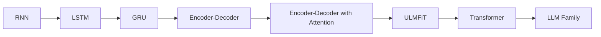

Instructor emphasis:
- Transformer appears after the encoder-decoder and attention era.
- Older seq2seq stacks used recurrent units; transformer shifted to attention-first modeling.

Timeline (year/month where confidently available):

| Stage | Approx timeline | Notes |
|------|------------------|-------|
| **RNN** | ~1986 onward | Early recurrent sequence modeling foundations. |
| **LSTM** | ~1997 | Introduced to improve long-range memory over vanilla RNN. |
| **GRU** | ~2014 | Simpler gated recurrent alternative to LSTM. |
| **Encoder-Decoder (seq2seq)** | **Sep 2014** | ArXiv `1409.3215` timeline (seq2seq era kickoff in this class narrative). |
| **Encoder-Decoder + Attention** | **Sep 2014** | ArXiv `1409.0473`; later recognized as key attention bridge. |
| **ULMFiT** | **Jan 2018** | ArXiv `1801.06146`; LM pretrain + task fine-tune framing. |
| **Transformer** | **Jun 2017** | ArXiv `1706.03762` (*Attention Is All You Need*). |
| **LLM family scaling era** | ~2018 onward | GPT-style large-scale pretraining and rapid capability scaling. |

Month values above come from arXiv IDs where available (`YYMM` prefix), and other entries are approximate historical anchors.

### 2) Why Transformer replaced LSTM-centric seq2seq (concept sketch)

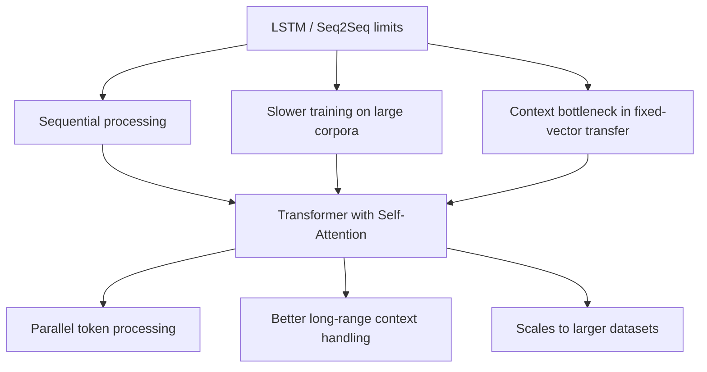

### 3) Transformer data path sketch used in class

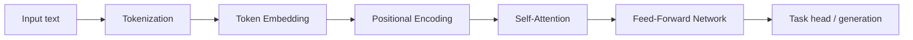

Diagram note:
- This class stayed at intuition + high-level architecture; deeper multi-head attention internals are expected in the next transformer sessions.

### Clean diagram captures (from attached PDF screenshots)

These are the clearest attached captures aligned with this class discussion.

**A) Transformer vs LLaMA-style decoder architecture**

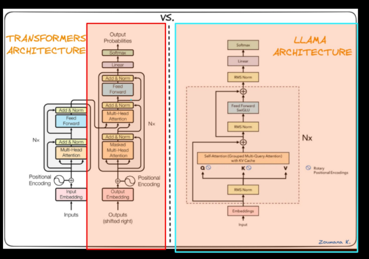

- Use this to remember: original transformer shows encoder+decoder stacks, while modern LLM families are commonly decoder-centric variants.

**B) Decoder-side focus for modern LLM families**

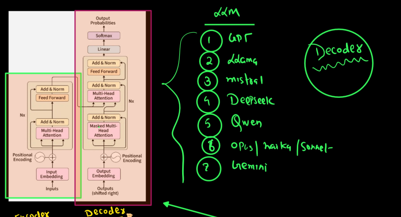

- Reinforces instructor mapping: GPT/Llama/Mistral/Qwen/DeepSeek family discussion as decoder-oriented deployment architectures.

**C) Encoder vs decoder process checklist (training-oriented board notes)**

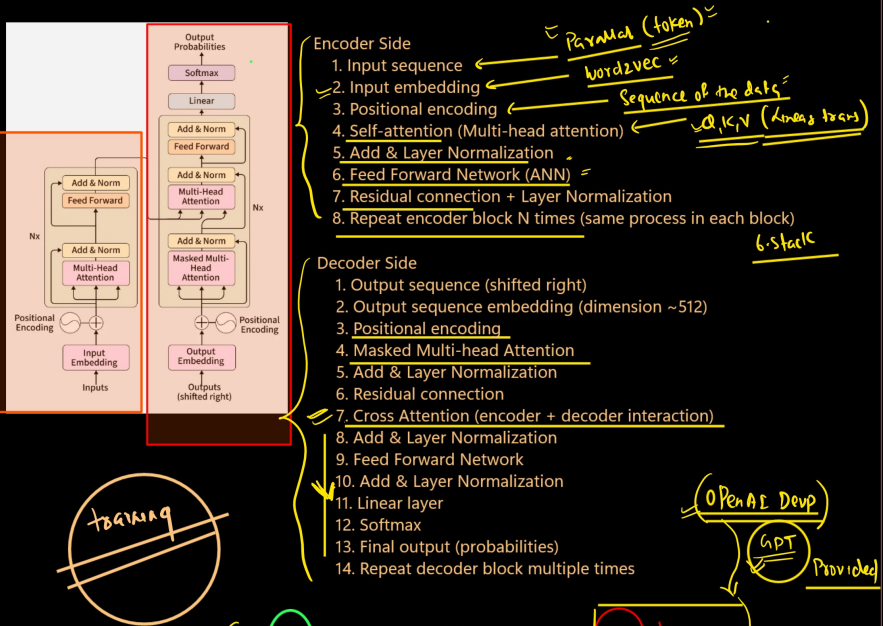

- Captures the board checklist: tokenization/embedding/PE/self-attention/FFN/normalization/residual and repeated stacks.

**D) Transformer block emphasis (PE + self-attention + FFN)**

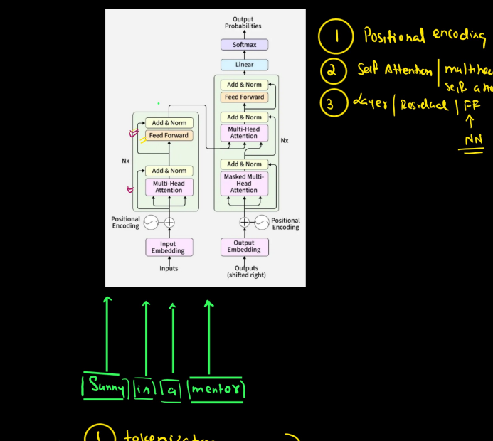

- Good quick-revision figure for the "main learning happens through self-attention + FFN" explanation.

**E) Self-attention intuition and contextual meaning**

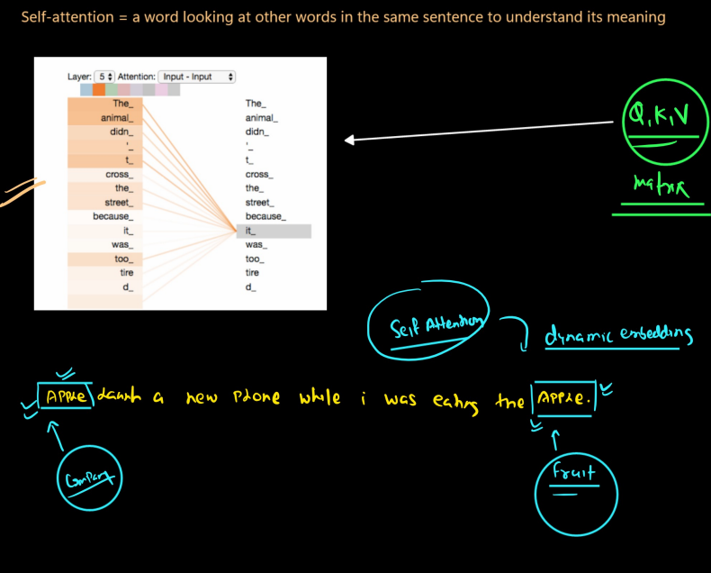

- Matches instructor examples where the same token meaning changes by sentence context (dynamic embeddings via self-attention).

**F) Simplified internal flow sketch (tokens -> embeddings -> PE -> self-attention -> FFN)**

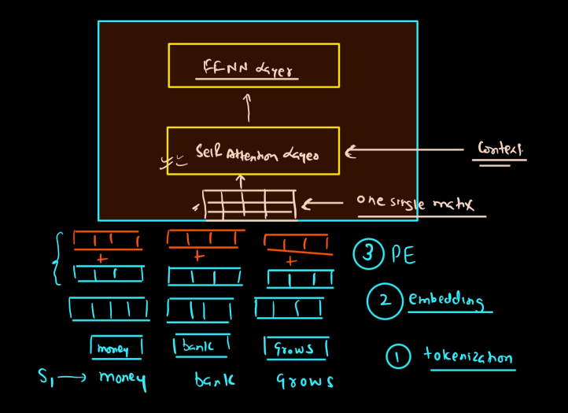

- Useful as a compact "mental model" after reading the formal transformer diagram.

**G) Cross-language attention heatmaps (alignment intuition)**

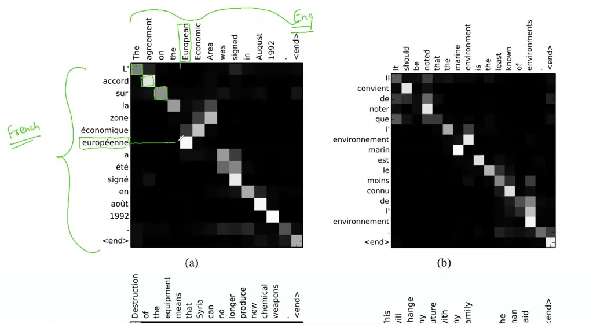

- Shows how attention can align source and target tokens in translation settings (older attention-era intuition before full self-attention deep dive).

**H) Attention-head behavior patterns (structure-focused heads)**

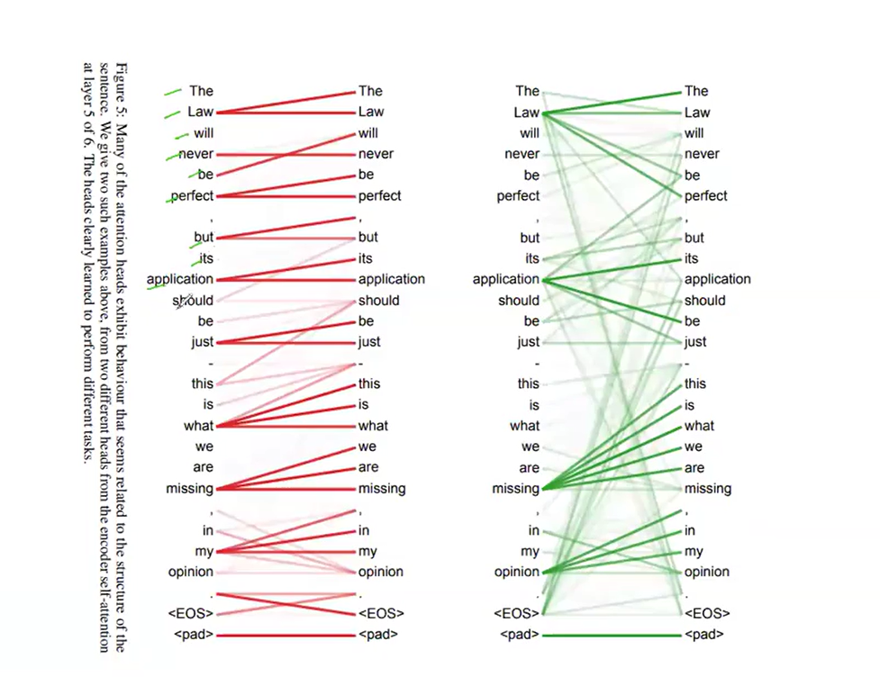

- Useful for understanding that different heads learn different relationship patterns (position/structure/syntax cues), not a single uniform behavior.

**I) Self-attention focus example (layer-head token view)**

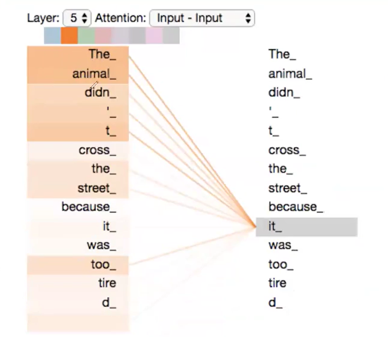

- Good reference for "a token attends to relevant context tokens" explanation used in class (connects directly to dynamic/contextual embeddings).

**J) Dynamic embedding disambiguation example ("Apple" context)**

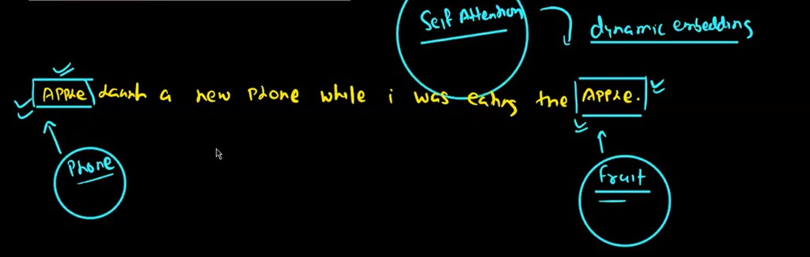

- Captures the exact class intuition: the same token can map to different meanings based on surrounding words (company/product context vs fruit context).

**K) End-to-end mini flow (tokenization -> embeddings -> PE -> self-attention -> FFN)**

- Useful as a compact bridge from preprocessing to the two core transformer learning blocks (self-attention and feed-forward network).

### 4) Research-paper map used with the flowchart

- Sequence-to-sequence (encoder-decoder): [https://arxiv.org/pdf/1409.3215](https://arxiv.org/pdf/1409.3215)
- Encoder-decoder with attention: [https://arxiv.org/pdf/1409.0473](https://arxiv.org/pdf/1409.0473)
- ULMFiT: [https://arxiv.org/pdf/1801.06146](https://arxiv.org/pdf/1801.06146)
- Transformer paper (*Attention Is All You Need*): [https://arxiv.org/pdf/1706.03762](https://arxiv.org/pdf/1706.03762)
- Illustrated Transformer explainer: [https://jalammar.github.io/illustrated-transformer/](https://jalammar.github.io/illustrated-transformer/)

---

## Handwritten PDF review (page 5 onward) with transcript cross-check

Instructor note in class indicated parts of the board were reused from earlier explanations ("old board" style continuation). The handwritten PDF is scanned-only (no selectable text on pages 5-11), so this mapping is reconciled using transcript cues.

### Page 5-11 consolidated mapping (what the board section corresponds to)

1. **History flow from recurrent models to transformer**
   - Matches transcript discussion: `RNN -> LSTM -> GRU -> Encoder-Decoder -> Encoder-Decoder + Attention -> ULMFiT -> Transformer`.
   - Key cue: instructor repeatedly says this is the timeline to explain where transformer "came into existence."

2. **Why older seq2seq/LSTM stack was insufficient**
   - Matches cues on:
     - sequential processing bottleneck,
     - weaker scalability on larger corpora,
     - fixed-vector/context compression pain in early encoder-decoder framing.
   - Key cue: "we were not able to train this LSTM model over very huge data."

3. **Attention vs Self-attention distinction**
   - Board content aligns with:
     - 2016 attention paper for translation alignment,
     - transformer self-attention within the same sentence.
   - Instructor examples used in transcript:
     - "turn on the light" (intra-sentence relation),
     - polysemy context examples (bank/money style disambiguation discussion).

4. **LSTM architecture vs Transformer architecture visual contrast**
   - Instructor explicitly says he is showing both architecture visuals and comparing interview-level differences.
   - Board interpretation from transcript:
     - recurrent/gated structure on LSTM side,
     - encoder-decoder transformer block stack on transformer side.

5. **Encoder-decoder block orientation and model-family mapping**
   - Matches transcript statements:
     - original transformer has encoder + decoder,
     - GPT/Llama/Mistral family described as decoder-oriented in modern usage,
     - BERT referenced as encoder-oriented.

6. **Preview of internal transformer topics (next-class bridge)**
   - Board cues correspond to the checklist the instructor spoke:
     - positional encoding,
     - self-attention / multi-head attention,
     - normalization + residual + feed-forward flow,
     - repeated encoder stack (paper used 6 layers).

### Confidence note for pages 5-11

- Since pages 5-11 are scanned board images without extractable text, the above is **high-confidence semantic alignment** from the transcript narrative, not OCR-exact transcription of each handwritten symbol.
- If you want strict page-by-page exactness, export each page as PNG and I can annotate every page with per-box labels.

---

## Research papers & study tips (from transcript)

Mentioned or linked in Notion during class (names as spoken):

- **Sequence to sequence learning with neural networks** (encoder–decoder).
- **Neural Machine Translation by Jointly Learning to Align and Translate** — early **attention** (2016).
- **Attention Is All You Need** — transformer architecture.
- **ULMFiT** — universal language model fine-tuning.
- **Language Models are Unsupervised Multitask Learners** (**GPT-2**) — LM pre-training angle.
- Tip: upload a PDF to **ChatGPT / Claude / Notebook LM** and ask for a **plain-language summary** to digest papers faster.

---

## Q&A themes (late session, condensed)

- **Which ML models on top of BoW/TF-IDF?** Classical tabular models (logistic regression, Naive Bayes, etc.) fit **structured/numeric** features; **unstructured** text/images/audio need **neural / transformer** (or CV) pipelines. Evolution: **encoding** → **Word2Vec** → **RNN/LSTM** → **contextual / transformer embeddings** — always “turn data into numbers” then train.
- **Pre-trained embedding / LLM APIs:** Check **vendor docs** (OpenAI, Google) or **Hugging Face** for open models; versioning (e.g. `001`) is normal.
- **Generative use:** Latest transformer LLMs stressed as **generative** (content generation), not only classification.
- **Debugging RAG / doc → features:** Quality depends on **prompt**, **data cleanliness**, **model reasoning capability**; reduce noise; iterate prompts; consider **workspace/notebook corruption** if outputs repeat oddly (try fresh folder/notebook).

---

## Links backward / forward

- **Previous:** [`../18Apr26/Notes.md`](../18Apr26/Notes.md) — SOTA embeddings, similarity, CLIP bridge.
- **Next (per class):** Deeper **transformer architecture** walkthrough (multi-head attention, layer stack) and more **practical** tokenization — instructor referenced prepared low-level notes for a future class.

---

**Study order:** Read this outline → skim **Notion + handwritten PDFs** → replay tricky segments in `Recording.transcript.vtt` by timestamp → keep **`Notes.md`** updated with your own examples.

---

## PDF sync snapshot (auto-updated: 25 Apr 2026)

- `19Apr26/Class-09-19-Apr-Handwritten-Notes.pdf` — 11 pages; scanned/handwritten style (no selectable text extracted). Notes use transcript + manual page review where available.
- `19Apr26/Class-09-19-Apr-Notion-Notes.pdf` — 1 pages; text extracted (900 chars). Key snippet: Class-08-09-18-Apr-19-Apr sentence transformer: https://huggingface.co/sentence-transformers Sentence transformer models: https://huggingface.co/models?library=sentence- transforme
